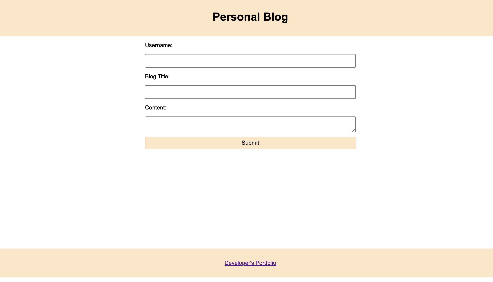
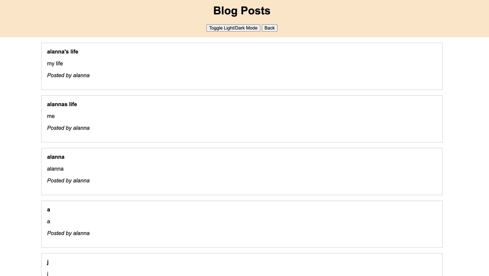

# Challenge4: 

## Description
This project is about creating a personal blog website with two pages: a landing page where users can submit new blog posts, and a posts page where users can view all the blog posts. This assignment provides hands-on experience with JavaScript for dynamic content handling, CSS for styling, and local storage for data persistence.

## Installation

1- First, create a new repository on GitHub. After setting it up, copy the HTTPS URL provided and clone the repository into Visual Studio Code (VS Code).

2-  With the repository cloned into VS Code, you can begin developing your project. Open the cloned repository and start coding.

3- Set Up Your Project Files: In VS Code, create the necessary HTML, CSS and JS files for your project. Additionally, organize and add any images or assets you plan to use. This will help keep your project structured and manageable.

4- Begin designing and styling your website according to your vision. Use HTML to structure the content and CSS to apply styles and layout adjustments.

5- Make regular commits to your GitHub repository. This will help track your progress and keep your code backed up. Use descriptive commit messages to explain the changes made.

6- Deployment: Once you are satisfied with your website, deploy it to a live server or hosting service so that others can view it. Update the repository with any final changes.

## Screenshots 

## Contributing

1- Create a new repository

2- Push your code to the repository 

3- Make your changes and commit

4- Open a pull request

## Contact

* The URL of deployed application: https://alannadf.github.io/Challenge4/

* The URL of the GitHub repository: https://github.com/alannadf/Challenge4.git